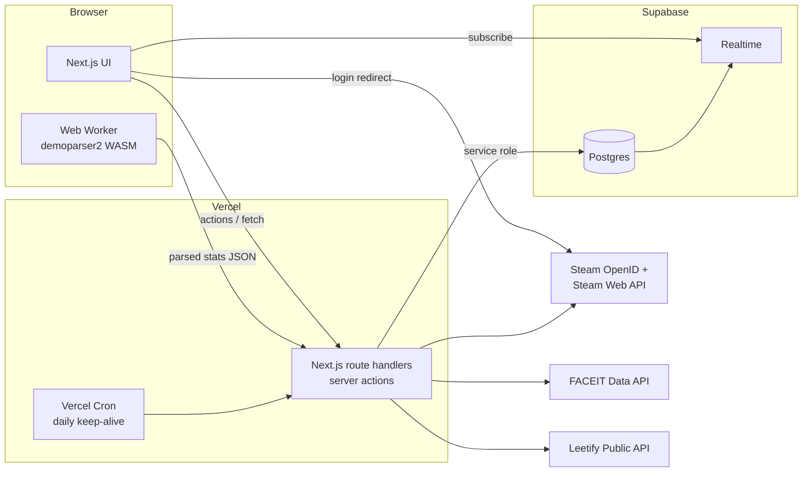

# Architecture

## Overview



## Stack

| Layer | Choice | Why |
|---|---|---|
| Framework | **Next.js (App Router, TypeScript)** | One codebase for UI and API, first-class on Vercel |
| Hosting | **Vercel Hobby** (free) | Zero ops, preview deploys per branch |
| Database | **Supabase Postgres** (free) | Managed Postgres + Realtime in one place |
| Realtime | **Supabase Realtime** (Postgres changes) | Live lobby and votes without running our own socket server |
| Auth | **Steam OpenID 2.0**, own session cookie | Steam has no OAuth2 for third parties; we only need the SteamID64 |
| Demo parsing | **demoparser2** (Rust → WASM) in a **Web Worker** | Demos are 50–300 MB; parsing client-side avoids upload limits and storage costs |
| UI | Tailwind CSS + shadcn/ui | Fast to build, looks decent out of the box |
| Charts | Recharts (or similar) | Profile trend charts |
| Validation | Zod | Validate parsed demo payloads and API responses |
| ORM / queries | Drizzle ORM (or supabase-js) | Typed schema + migrations in the repo |

## Auth

1. `GET /api/auth/steam` redirects to `https://steamcommunity.com/openid/login` with our return URL.
2. `GET /api/auth/steam/callback` verifies the assertion server-side (`openid.mode=check_authentication`
   back to Steam), then extracts the SteamID64 from `openid.claimed_id`.
3. Upsert `players` by `steam_id` (claims an admin-created record if it exists), set a signed,
   httpOnly session cookie (`jose` JWT: `player_id`, `steam_id`, `is_admin`, 30-day expiry).
4. The `is_admin` flag lives in the DB; the bootstrap admin comes from the env var `ADMIN_STEAM_IDS`.

Players not on the roster can log in but only get guest rights until an admin approves them
(or join is open, configurable).

## Data access pattern

- **All writes go through Next.js server code** using the Supabase **service role** key
  (never shipped to the browser). Every write checks the session and permissions in code.
- **Reads for realtime** (`mixes`, `mix_participants`, `variants`, `votes`) use the Supabase anon
  key with RLS policies that allow `select` only. None of this data is sensitive in our group.
- This avoids minting Supabase-compatible JWTs for a non-Supabase login provider and keeps
  authorization logic in one place (TypeScript).

## Realtime

- The client subscribes to Postgres changes filtered by `mix_id` on `mix_participants`, `votes` and `mixes`.
- Server code performs state transitions (e.g. auto-lock when 10/10 voted) inside a transaction.
- Why not Kafka: see [decisions](08-decisions.md#d3-realtime-supabase-realtime-not-kafka).

## Demo processing

See [demo pipeline](05-demo-pipeline.md). In short: file picked in the browser → Web Worker
decompresses (if `.bz2`) and parses with demoparser2 WASM → stats computed in TypeScript →
POST ~50 KB JSON to `/api/matches` → validated with Zod → stored.
We store a SHA-256 of the demo header to reject duplicate uploads.

## External data

- **FACEIT Data API**: ELO, level and recent match stats, used for balancing. Snapshots are stored per mix.
- **Leetify Public API**: displayed live on profiles only; **never stored** (their terms).
- **Steam Web API**: names and avatars (`GetPlayerSummaries`), vanity URL resolution.

All external calls run server-side with keys in env vars and use short in-memory / `fetch` caching (minutes).
Details: [external APIs](06-external-apis.md).

## Free-tier constraints to design around

| Constraint | Impact | Mitigation |
|---|---|---|
| Supabase free projects **pause after ~7 days of inactivity** | We play ~10×/year | Vercel Cron hits `/api/cron/keepalive` daily (a trivial `select 1`) |
| Vercel function **request body ~4.5 MB** | Demos cannot be uploaded to our API | Parse in the browser, upload only stats |
| Supabase DB 500 MB | Fine: stats per match are tiny | Do not store demo files |
| Vercel Hobby is for non-commercial use | OK for a friends' app | – |

## Environment variables

```
NEXT_PUBLIC_SUPABASE_URL=
NEXT_PUBLIC_SUPABASE_PUBLISHABLE_KEY=   # sb_publishable_… (new-style, replaces anon)
SUPABASE_SECRET_KEY=                    # sb_secret_… (new-style, replaces service_role), server only
SESSION_SECRET=
APP_URL=                 # used for the Steam OpenID return URL
STEAM_WEB_API_KEY=
FACEIT_API_KEY=
LEETIFY_API_KEY=
ADMIN_STEAM_IDS=         # comma-separated SteamID64s
CRON_SECRET=
```

## Repository layout (planned)

```
mixer/
  app/                    # Next.js routes (pages + route handlers)
    (public)/mixes/[id]/
    (public)/players/[steamId]/
    admin/
    api/auth/steam/
    api/mixes/
    api/matches/
    api/cron/keepalive/
  lib/
    balance/              # pure TS: skill score, split enumeration, variant selection (unit-tested)
    demo/                 # worker + stat calculation from parsed events (unit-tested)
    external/             # faceit.ts, leetify.ts, steam.ts clients
    db/                   # schema + queries
  db/migrations/
  docs/
```
