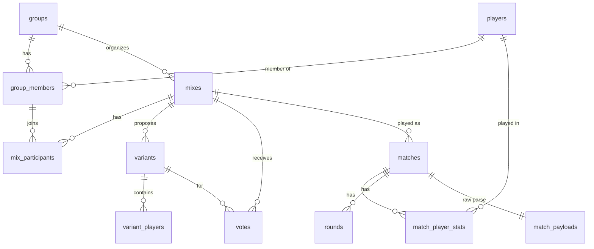

# Data model

Postgres (Supabase). IDs are `uuid` unless noted; all tables have `created_at timestamptz default now()`.
SteamIDs are stored as `text` (SteamID64 exceeds JS safe integers).
Migrations: `db/migrations/` (how they are applied: [lib/db/README.md](../lib/db/README.md)).

Integrity enforced in the database (Phase 1):
- **Hard cap 10** per mix: `before insert` trigger on `mix_participants` locks the mix row, then counts (safe under concurrent joins).
- **Only active group members join a mix:** the same trigger copies the mix's `group_id` and rejects players whose membership is closed; the composite fks make a participant from another group impossible.
- **Votes:** `(mix_id, voter_id)` references `mix_participants` (only participants vote); `(variant_id, mix_id)` references `variants (id, mix_id)` (only a variant of the same mix). Same composite key pins `mixes.chosen_variant_id` to the mix.
- **RLS:** enabled on all tables (incl. `groups`, `group_members`), one `select` policy for `anon`/`authenticated`, write grants revoked; the secret key (service role) bypasses RLS.
- **Realtime publication:** `mixes`, `mix_participants`, `variants`, `votes`.

## groups
A friend group using the app (D18). Everything mix-related belongs to one group.
| column | type | notes |
|---|---|---|
| id | uuid pk | |
| slug | text unique | URL part, `a-z0-9-`, 3–40 chars |
| name | text | 2–60 chars |
| faceit_club_url | text null | FACEIT Club where the group plays (D17); must start with `https://(www.)faceit.com/` |
| faceit_club_id | text null | parsed from the link / Data API, to list club matches (M2-2) and exclude them from form F |
| discord_guild_id | text unique null | Discord server linked to the group (Phase 5) |
| discord_settings | jsonb | bot settings: lobby / team A / team B voice channel ids, notification channel |
| created_by | uuid fk players | becomes the first group admin |

## group_members
| column | type | notes |
|---|---|---|
| group_id | uuid fk | pk (group_id, player_id) |
| player_id | uuid fk | |
| role | text | `admin` · `member` |
| manual_skill_override | int null | group admin's fallback ELO if FACEIT data is missing |
| added_by | uuid fk players null | |
| joined_at | timestamptz | |
| left_at | timestamptz null | set instead of deleting, so past mixes still resolve; only `left_at is null` members can join mixes |

## players
One Steam identity across the whole app (can be in several groups).
| column | type | notes |
|---|---|---|
| id | uuid pk | |
| steam_id | text unique not null | SteamID64 (17 digits, checked) |
| display_name | text | from Steam, refreshable |
| avatar_url | text | |
| faceit_player_id | text unique null | resolved from SteamID via FACEIT API |
| faceit_nickname | text null | |
| discord_user_id | text unique null | linked via Discord OAuth (Phase 5) |
| preferred_role | text check in ('awp','rifle','any') | default `any` |
| is_site_admin | bool default false | platform admin (bootstrap: `ADMIN_STEAM_IDS`) |
| last_login_at | timestamptz null | null = added by an admin, never logged in |

## mixes
| column | type | notes |
|---|---|---|
| id | uuid pk | |
| group_id | uuid fk groups | |
| title | text | e.g. "Mix #12 — Friday" |
| scheduled_at | timestamptz null | |
| status | text | `open` · `balancing` · `voting` · `locked` · `played` · `cancelled` |
| created_by | uuid fk players | |
| chosen_variant_id | uuid fk variants null | set when locked |
| balance_config | jsonb | weights used (for reproducibility) |

## mix_participants
| column | type | notes |
|---|---|---|
| mix_id | uuid fk | pk (mix_id, player_id) |
| player_id | uuid fk | |
| group_id | uuid | copied from the mix by the insert trigger; fks to `mixes (id, group_id)` and `group_members (group_id, player_id)` |
| added_by | uuid fk players | self or admin |
| skill_snapshot | jsonb | inputs at balancing time: FACEIT ELO, form, mix rating, final score |

## variants
| column | type | notes |
|---|---|---|
| id | uuid pk | |
| mix_id | uuid fk | |
| number | smallint | 1..3 (increments on re-roll: 4..6 …) |
| is_published | bool | |
| team_a_score / team_b_score | numeric | summed / averaged skill |
| win_prob_a | numeric | 0..1 |
| penalty | numeric | pairing penalty (debug/explanation) |

## variant_players
| column | type | notes |
|---|---|---|
| variant_id | uuid fk | pk (variant_id, player_id) |
| player_id | uuid fk | |
| team | char(1) | `A` / `B` |

## votes
| column | type | notes |
|---|---|---|
| mix_id | uuid fk | pk (mix_id, voter_id): one vote per player per mix |
| voter_id | uuid fk players | must be a participant |
| variant_id | uuid fk | |
| cast_by | uuid fk players | = voter_id, or an admin voting on their behalf |
| updated_at | timestamptz | |

## matches
One row per map played (a mix is usually one map).
| column | type | notes |
|---|---|---|
| id | uuid pk | |
| mix_id | uuid fk null | null = standalone upload |
| map_name | text | e.g. `de_mirage` |
| played_at | timestamptz | from demo header or manual |
| score_a / score_b | smallint | Team A / B as in the locked variant |
| winner | char(1) null | `A` / `B` / null for a draw |
| source | text | `manual` · `demo_pov` · `demo_gotv` |
| demo_hash | text unique null | dedupe |
| demo_recorder_id | uuid fk players null | whose POV demo |
| parser_version | text | so stats can be recomputed after formula changes |
| uploaded_by | uuid fk players | |

## match_player_stats
| column | type | notes |
|---|---|---|
| match_id | uuid fk | pk (match_id, player_id) |
| player_id | uuid fk | |
| team | char(1) | |
| kills, deaths, assists | smallint | |
| damage | int | total damage to enemies (capped at victim HP) |
| rounds | smallint | rounds played |
| adr | numeric | |
| hs_kills | smallint | |
| kast_rounds | smallint | rounds with Kill/Assist/Survived/Traded |
| first_kills, first_deaths | smallint | opening duels |
| trade_kills, traded_deaths | smallint | |
| multi_2k … multi_5k | smallint | |
| clutch_attempts, clutch_wins | smallint | 1vX |
| utility_damage | int | HE + molotov |
| enemies_flashed, flash_assists | smallint | |
| rating | numeric | mixer rating (HLTV 2.0-style approximation) |
| raw | jsonb | anything extra, for future stats without a migration |

## match_payloads
The document-style part: the full parser output for a match, kept so stats can be recomputed.
| column | type | notes |
|---|---|---|
| match_id | uuid pk fk | |
| parser_version | text | |
| payload | jsonb | per-round kills/damage/economy/alive counts, everything the stat formulas need |

Why this is not a separate document database: see [decisions D12](08-decisions.md#d12-mix-analysis-data-postgres-with-jsonb-not-a-separate-document-db).

## rounds
| column | type | notes |
|---|---|---|
| match_id | uuid fk | pk (match_id, number) |
| number | smallint | |
| winner | char(1) | |
| reason | text | elimination / bomb_exploded / defused / time |
| ct_team | char(1) | which of A/B was CT |

## Derived views (no extra storage)
- `player_mix_summary`: per player aggregates over all mix matches (maps, W/L, avg rating, ADR, K/D, KAST%).
- `player_recent_mix_rating`: rating over the last N mix maps, used by balancing.
