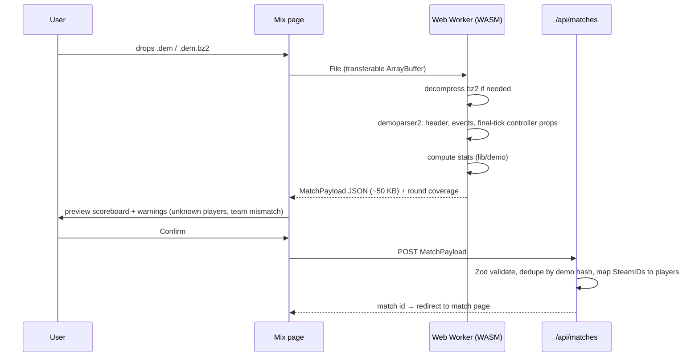

# Demo pipeline

How we get a demo of each mix, and how we turn it into popflash-style stats.

## Getting the demo: two paths

### Path A: Valve Private Matchmaking (current way of playing, free)

We queue two premade fives against each other on Valve servers. Options, in order of preference:

**A1. Download from the CS2 client.** If private matches show up in
*Watch → Your Matches* with a download button, anyone can grab the full GOTV demo (best quality).
→ **Spike S2** checks this after the next mix. If it works, Path A is easy.

**A2. POV recording (fallback that always works).**
A designated recorder types this in the console once they are on the server (after warmup starts):

```
record mix_12
```

The demo ends on disconnect or map change and is saved in `...\Counter-Strike Global Offensive\game\csgo\mix_12.dem`.

Rules to make it reliable:
- The mix page shows **one Recorder** (default: admin) with the exact command to paste.
  **One recording is enough.** An optional **backup recorder** exists only as insurance: if the
  recorder crashes or reconnects, their recording stops and those rounds are lost.
  The backup can be on either team. Picking one from the other team only matters if spike S1 shows
  POV demos miss data about the enemy team.
- If the recorder reconnects, recording stops. They must `record mix_12_part2` again. v1 accepts
  only one file per match and shows a warning when the demo does not cover all rounds.
- Upload whichever demo covers more rounds (the app shows round coverage after parsing).

**POV demo quality.** Scoreboard numbers (K/D/A, damage, headshots, utility damage, enemies flashed,
multikills, MVPs) come from the **player controller entities**, which are always networked to every
client. They should be exact even in a POV demo. Event-based stats (KAST, trades, opening duels,
clutches) depend on `player_death` / `player_hurt` events reaching the recorder.
→ **Spike S1** compares a POV demo with the in-game scoreboard to see which stats are trustworthy.

### Path B: own server (DatHost + MatchZy), optional later

A rented CS2 server running the [MatchZy](https://github.com/shobhit-pathak/MatchZy) plugin:
- The app sends the locked lineup to the server (MatchZy loads a match config by URL: team names,
  SteamIDs per team, map), so players cannot join the wrong team.
- GOTV records automatically, so there is no "someone forgot to record" problem.
- MatchZy can POST match events and end-of-map stats to a webhook, giving us the scoreboard
  **without** handling a demo at all. The demo itself would go to object storage (e.g. Cloudflare R2
  free tier) via a presigned URL, because it cannot pass through a Vercel function.
- DatHost bills only while the server runs, so ~10 mixes/year cost very little. Check current pricing before committing.
- Downsides: no Valve queue (players `connect` to an IP), someone must start the server, and it is
  one more moving part.

**Decision for now:** build for **Path A** (A1 if available, else A2). Keep the stats code
source-agnostic (`source` column), so Path B can be added without schema changes.

## Parsing

Library: [demoparser2](https://github.com/LaihoE/demoparser) by LaihoE (Rust core; Python, Node and WASM builds).

### Flow (in the browser)



### Data extracted

| From | Fields |
|---|---|
| Header | map name, server name, playback ticks |
| Events | `round_start`, `round_freeze_end`, `round_end` (winner, reason), `round_officially_ended`, `player_death` (attacker, victim, assister, `assistedflash`, weapon, headshot, tick), `player_hurt` (attacker, victim, `dmg_health`, weapon, victim health), `player_blind`, `bomb_planted`, `bomb_defused` |
| Ticks | per-round `team_num`, `is_alive`; controller match-stat props at the final tick (kills, deaths, assists, damage, utility damage, enemies flashed, 3k/4k/5k, headshot kills, MVPs) |

Warmup and knife rounds are excluded (use `is_warmup_period`, and only count rounds after the
first `round_freeze_end` of the live match).

**Browser feasibility:** demoparser2 is written for speed. A desktop browser holds a 100–300 MB file in
memory without trouble, and parsing runs in a Web Worker so the page does not freeze. Spike S4 confirms this.
Phones are not supported for uploads.

**Fallback if WASM is a problem:** no server needed. The same logic runs in a small Python script
(`pip install demoparser2`) that the admin runs locally on demand. It uploads the same JSON payload.

**Raw payload is kept.** The full parsed payload (events summary, per-round data) is stored as `jsonb`
in `match_payloads`, next to the computed stats. When formulas change (Mixer Rating 2 → 3), we recompute
from it without re-uploading demos.

## Stat definitions

All per match, per player. `R` = rounds played.

| Stat | Definition |
|---|---|
| K / D / A | from `player_death`; team kills and suicides do not count as kills |
| ADR | Σ damage to enemies, each hit capped at the victim's remaining HP, ÷ R |
| HS% | headshot kills ÷ kills |
| Opening kill / death | first `player_death` of the round (attacker / victim) |
| Trade kill | killing an enemy within **5 s** after that enemy killed a teammate |
| Traded death | player died and a teammate killed the killer within 5 s |
| KAST | % of rounds with a **K**ill, **A**ssist, **S**urvived, or **T**raded death |
| Multikill 2k–5k | rounds with N kills |
| Clutch 1vX | player becomes the last alive on their team with X ≥ 1 enemies alive; won if their team wins the round |
| Utility damage | damage from `hegrenade`, `inferno`, `molotov`, `incgrenade` |
| Enemies flashed | `player_blind` on enemies with duration > 0.5 s |
| Flash assist | `player_death.assistedflash = true` for the assister |
| KPR / DPR / APR | kills / deaths / assists ÷ R |

### Rating

**What HLTV published about Rating 3.0** (2025, weights adjusted Oct 2025): the *structure* is public,
not the exact weights. It combines six sub-ratings: Kills, Damage, Survival, KAST, Multi-kills and
**Round Swing**. Kills, damage and survival are adjusted for the economy of each duel. Round Swing is how
much each action changes the team's round-win probability, given map, side, economy, players alive
and bomb status. HLTV computes this from a model trained on a very large pro dataset that we do not have.

So we do it in two steps:

**v1: Mixer Rating 2** (at launch). A community approximation of Rating 2.0 that needs only
basic stats:

```
Impact = 2.13·KPR + 0.42·APR − 0.41
Rating = 0.0073·KAST% + 0.3591·KPR − 0.5329·DPR + 0.2372·Impact + 0.0032·ADR + 0.1587
```
(KAST in percent, e.g. 72.) Sanity check: KPR 0.70, DPR 0.65, APR 0.15, KAST 72, ADR 80 gives ≈ 1.12.

**v2: Mixer Rating 3** (later, after v1 works). Same idea as HLTV 3.0, with our own simplified models:
- **Swing**: round-win probability from a lookup table keyed by *(players alive CT, players alive T,
  bomb planted?)*. Build it from the public pro-match research, or from our own parsed demos
  (FACEIT demos help reach enough rounds). Every kill or death moves the probability. The change is
  credited to the killer (with a share for damage dealers and flash assisters) and debited from the victim.
- **Eco adjustment**: equipment value of both players at the moment of the kill (available in the demo).
  A kill with a pistol against a rifle is worth more than the reverse.
- Final score = sub-ratings normalised to our group's average, weights tuned so that the group average ≈ 1.00.

We never call it "HLTV rating" in the UI, because the weights are ours.

Every stored match records `parser_version`. If we change a formula, we can recompute from `raw`
where possible, or ask for a re-upload.

## First parse test (2026-09-24)

A FACEIT GOTV demo (de_nuke, 216 MB `.dem`, 157 MB as `.dem.zst`) parsed with the **native**
`@laihoe/demoparser2` (Node, cloud sandbox): header + player list + `player_death` / `player_hurt` /
`round_end` in **~1.8 s, ~95 MB RSS**. Browser/WASM numbers are still open (S4). Lessons for M2-3:
- **Restarts:** the demo had two `round_announce_match_start` events (tick 1280 and 5262). Only rounds
  after the **last** one count; otherwise a pre-match round leaks in (20 → 18 real rounds).
- **ADR:** `player_hurt.dmg_health` includes overkill (a 205 "ADR" came out). Cap each hit at the
  victim's remaining health (`health` before the hit) to match scoreboard ADR.
- **Score per team:** `round_end.winner` is a side (T/CT); map it to teams using the halftime swap
  (after round 12 in MR12, and every 3 rounds in OT).
- `parsePlayerInfo` gives SteamID64 + name + team, enough to map players to the roster.

## Validation on upload

- Every player in the demo must map to a roster SteamID. Unknown players are shown and can be ignored or added.
- Team composition should match the locked variant (warn, do not block: someone may have swapped).
- Reject a duplicate `demo_hash`.
- Warn if rounds parsed < rounds in the final score (partial POV demo).
